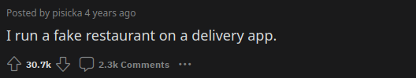

# reddit-shorts-automated
A simple Python script to create those nasty short TikTok-like content. It transforms [teddit](https://github.com/teddit-net/teddit) API post endpoint to a video with tts, subtitles and background. It is based on [this repo](https://github.com/FujiwaraChoki/MoneyPrinter/). 

**WARNING** this project is doomed. I'm not a good Python dev, but I've tried to do it as good as I can. It works though.

## Preview
Example result:<br>


Example preview image:<br>


## Installation
**WARNING** in the main dir of the project is a very large (282MB) background video file.
```sh
# Clone the repo and enter it
git clone https://github.com/D00NIK/reddit-shorts-automated/
cd reddit-shorts-automated

# Create a virtual env and activate it. OPTIONAL, but advised
python3 -m venv .venv
source .venv/bin/activate

# Install the requirements and you're done
pip install -r requirements.txt
```

## Usage
Simply run the main file, you can optionally add in a teddit endpoint so it scrapes it instead of the one used in config file.
```sh
python main.py "https://teddit.zaggy.nl/r/confession/comments/dju74z/i_run_a_fake_restaurant_on_a_delivery_app?api"

# or if configured
python main.py
```

But you probably want to [configure it instead](https://github.com/D00NIK/reddit-shorts-automated#configuration).

## Configuration
You can change these in `config.yaml`
| Variable            | Type   | Description                                                                                                                                    |
|---------------------|--------|------------------------------------------------------------------------------------------------------------------------------------------------|
| BG_VIDEO_PATH       | String | Path to a background video file                                                                                                                |
| CLEAN_TEMP          | Bool   | Clean temp folder afterward                                                                                                                    |
| CUSTOM_CONTENT_PATH | String | Path to a file containing content to be said in the video e.g. "content.txt"                                                                   |
| CUSTOM_TITLE        | String | It'll use this title instead of the scraped one                                                                                                |
| RESULTS_FOLDER      | String | Path to a folder in which to save results                                                                                                      |
| PREVIEW_PATH        | String | Path to a template from which to render preview image                                                                                          |
| SPEED_FACTOR        | Float  | Video is sped up by this factor                                                                                                                |
| TARGET_FPS          | Int    | The result's target FPS                                                                                                                        |
| TEDDIT_ENDPOINT     | String | API endpoint from which to gather Reddit post                                                                                                  |
| TEMP_FOLDER         | String | Path to a folder in which to save temp files                                                                                                   |
| TIKTOK_VOICE        | String | This project uses tiktok-tts, so you can here select a desired voice. https://github.com/Steve0929/tiktok-tts?tab=readme-ov-file#speaker-codes |

The rest options are font settings for subtitles and options for part division (which is not completed yet).

## How it works in greater detail
1. Grab info from any [teddit](https://github.com/teddit-net/teddit) API endpoint e.g. "https://teddit.zaggy.nl/r/confession/comments/dju74z/i_run_a_fake_restaurant_on_a_delivery_app?api".
2. Using `previews/preview.html` and [html2image](https://github.com/vgalin/html2image) it generates a preview image. **WARNING** be sure to have a Google Chrome browser, as it's the only one working with it (at least for me).
3. Clean and divide content text into renderable pieces by [tiktok-tts](https://github.com/Steve0929/tiktok-tts).
4. Render audio files.
5. Render subtitles and generate an SRT file with timestamps based on audio files duration and equalize them.
6. Resize the background video to a 9:16 one and randomly cut it so it has the duration of all audio files combined.
7. Burn preview, audio and subtitles to the video in the corresponding moments and save it.

This project heavily uses [moviepy](https://github.com/Zulko/moviepy).

## Credits, License, etc.
This project is MIT licensed, as it's ["parent"](https://github.com/FujiwaraChoki/MoneyPrinter/) but used components may not be. If I took someone's else code, it is said in the comment above that code. All external libraries are listed in `requirements.txt` file.
